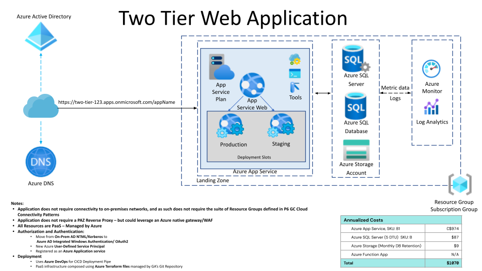

# azure-2-tier-web-sample

This repository serves as an example of a typical small two-tier web application, deployed to Azure.  The application code and the terraform (infrastructure as code) to deploy it are all contained within.

## Technology Stack
* Azure App Service
* Azure SQL Server (DTU pricing)
* Terraform
* .NET 6 application (C#)

## Architecture




## Deployment Requirements
For the purpose of demonstration, you can deploy locally with the `az` CLI utility for authentication to azure, and the `terraform` command  to provision your resources.  Make sure you have Contributor permissions to a new subscription for demonstration purposes.

## Steps to deploy
From the infra/ directory:

```
az login

# Confirm you are using the right subscription with:
az account show

# If not, change with:
az account set --subscription="xxxxxx-xxxx-xxxx-xxxx-xxxxxx"

# FIRST TIME run?
terraform init

# To see the changes this terraform would do (non-destructive):
terraform plan -var-file prod/shared.tfvars

# To both plan and apply, use:
terraform apply -var-file prod/shared.tfvars
```

## Steps to Cleanup
To clean up after yourself, simply:

```
terraform destroy -var-file prod/shared.tfvars
```


## TODO
- [ ] Develop github action deployment 
- [ ] Develop DevOps pipeline deployment

